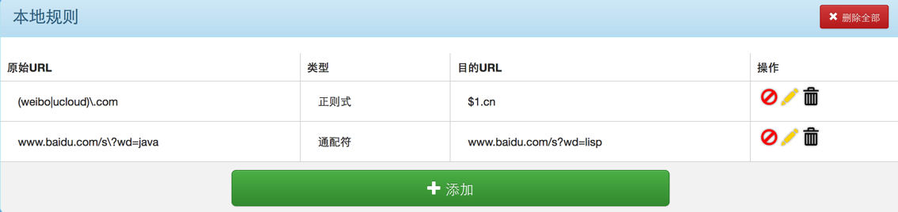

## WARN

Firefox PC 较新版（2.0之后）没能通过 Mozilla 审核，他们认为重定向 JS 文件对用户危害较大（[review 流程邮件](https://drive.google.com/file/d/0B7zV3Ct1fa9dMWNPX05VREtDbkNRNk9neWtkLVctZ1B2ckZV/view)），不过幸好 Mozilla 提供了 [self-host](https://developer.mozilla.org/en-US/Add-ons/Distribution#Signing_your_add-on) 机制，想使用最新版的可直接下载 [gooreplacer-2.2-an+fx.xpi](src/web-ext-artifacts/gooreplacer-2.2-an+fx.xpi) 后拖到 Firefox 中即可。

## [gooreplacer](http://liujiacai.net/gooreplacer)

> A replacer for google fonts/api/themes.... to load page faster!

一个用于替换网页中 `Google Fonts/CSS/themes` 等被墙服务的 Chrome/Firefox 插件，让你快速打开这些页面！

- [Chrome版](https://chrome.google.com/webstore/detail/gooreplacer/jnlkjeecojckkigmchmfoigphmgkgbip)
- [Firefox PC 版](https://addons.mozilla.org/zh-CN/firefox/addon/gooreplacer/)
- [Firefox Android 版](https://github.com/jiacai2050/gooreplacer/tree/android)


<a name="intro"></a>
## Why gooreplacer

众所周知，Google 在某国造到全面封杀，导致无法访问 Google 的一切资源，如果一个网站引用了 Google 提供的 JS、CSS 库，那么页面加载就会变得巨慢。有图有真相：


除了 Google 被墙外，很多国外常用服务也未能幸免，比如：gravatar、twitter 等。
gooreplacer 的作用就是在浏览器发起请求时，去检查该请求是否为被墙服务，如果是，替换为国内的反向代理，目前使用的是[科大公共库](https://servers.ustclug.org/2015/09/google-revproxy-add-cache/)。感谢科大！🙏

<a name="usage"></a>
## 使用说明

1. 下载后，选中“开启重定向”。这样就会按照[默认规则](https://github.com/jiacai2050/gooreplacer/raw/master/gooreplacer.gson)进行替换了。

    

2. 除了[默认的在线规则](https://github.com/jiacai2050/gooreplacer/raw/master/gooreplacer.gson)外，用户还可以根据需要进行自定义本地规则。

    

在自定义规则时，支持两种类型：

- 通配符，在 gooreplacer 内部用`kind: wildcard`标示
- 正则式，在 gooreplacer 内部用`kind: regexp`标示

### 通配符类型

在通配符类型中，原始URL中可以使用`*`与`?`模糊匹配，如果需要表示这两个字符自身的含义，需要使用`\`进行转义。例如：

```
www.baidu.com/s\?wd=java   ----通配符--->  www.baidu.com/s?wd=lisp
```

此外，可以使用`^`、`$`表示字符的开始与结尾。例如：

```
baidu.com/$  ----通配符--->  baidu.com/?
```
这样就能够把`baidu.com/`重定向到`baidu.com/?`了，[据说](http://v2ex.com/t/169967#reply2)，这样能防止劫持吆 -:)

### 正则式类型

在正则式类型中，原始URL中可以使用JS中的[正则表达式](https://developer.mozilla.org/zh-CN/docs/Web/JavaScript/Reference/Global_Objects/RegExp)语法定义，目的URL中如果要反引用原始URL中的分组，需要使用$1、$2、$3......。例如：

```
(weibo|ucloud)\.com  ----正则式--->  $1.cn
```

这样就把`weibo.com`、`ucloud.com`分别重定向到`weibo.cn`与`ucloud.cn`了。



<a name="test"></a>
## 测试

在浏览器地址栏中输入以下链接，如果能转到 `proxy.ustclug.org` 或 `cdn.rawgit.com` 相应的资源即说明替换成功。

- https://ajax.googleapis.com/ajax/libs/jquery/1.8.1/jquery.min.js
- https://storage.googleapis.com/io13/gcs_import/index.html
- https://gerrit.googlesource.com
- https://www.gravatar.com
- https://apis.google.com/js/api.js
- https://apis.google.com/js/plusone.js
- https://platform.twitter.com/widgets.js


<a name="dev"></a>
## 开发

- 使用[Chrome extension webRequest](https://developer.chrome.com/extensions/webRequest)模块开发
- 使用[科大公共库](https://servers.ustclug.org/2014/07/ustc-blog-force-google-fonts-proxy/)开替换Google资源,之前曾使用360公共库，但是[360并不支持https访问](https://servers.ustclug.org/2014/06/blog-googlefonts-speedup/)，所以最终选择了科大。

## License

[MIT License](http://liujiacai.net/license/MIT.html?year=2015) © Jiacai Liu
